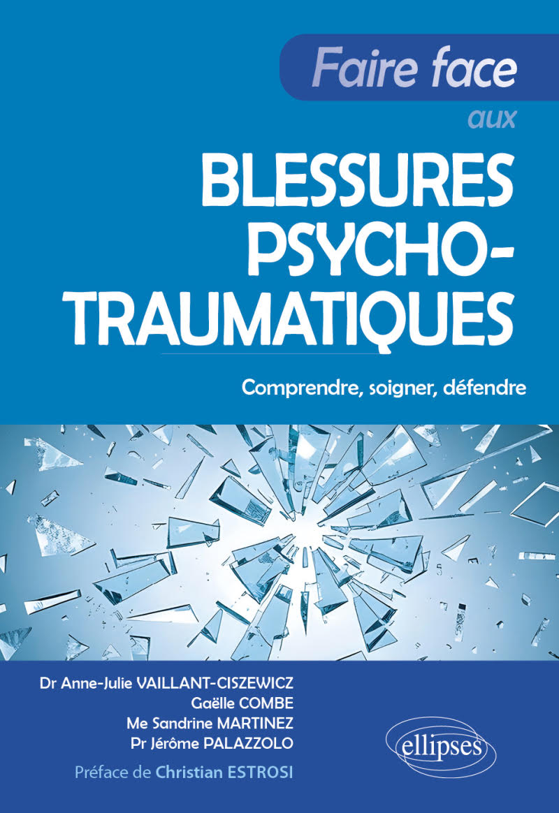

Un ouvrage essentiel pour mieux comprendre, soigner et défendre celles et ceux que le trauma a blessés et redonner sens à la reconstruction.

Ce livre explique simplement ce qu’est le psychotraumatisme, comment il se forme, se manifeste, et surtout comment accompagner et soigner celles et ceux qui en souffrent.
Avec un langage clair et des exemples concrets, les auteurs éclairent un processus où s’entremêlent émotions, mémoire, sensations corporelles et mots pour aider à comprendre, agir et protéger.

- Une mise au point scientifique accessible et humaine sur le psychotraumatisme,
- Des situations réelles qui illustrent la théorie et évitent les idées reçues,
- Des conseils pratiques pour repérer, écouter, intervenir et orienter,
- Des approches thérapeutiques validées présentées de façon claire et des trajectoires de soins,
- Une perspective pluridisciplinaire croisant psychologie, psychiatrie, médecine et droit, pour comprendre et agir à chaque étape.

 

