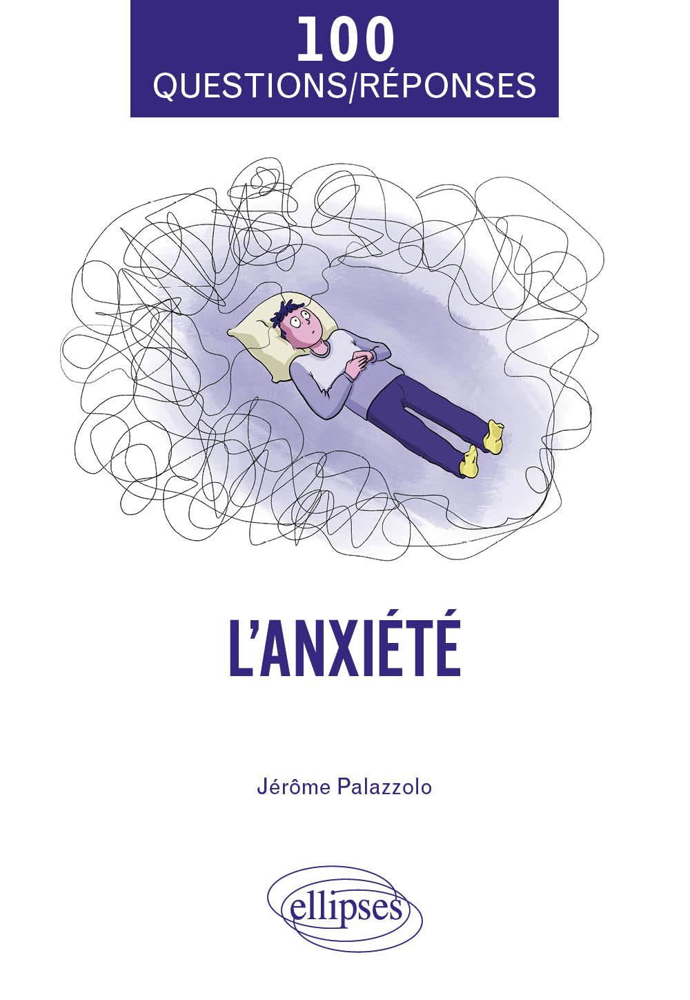

Et si vous compreniez enfin ce qui se joue derrière votre anxiété ?
Et si, au lieu de la subir, vous appreniez à l’apprivoiser ?
Dans un monde où tout va trop vite, où l’incertitude s’invite partout (au travail, dans la vie familiale, à l’école, sur les réseaux sociaux), l’anxiété est devenue le mal du quotidien.

Ce livre s’adresse à tous ceux qui cherchent des réponses claires, fiables et rassurantes : étudiants sous pression, adultes épuisés, parents inquiets pour leurs enfants, professionnels qui veulent mieux accompagner ou simplement lecteurs désireux de comprendre leur fonctionnement intérieur.

Écrit par un psychiatre expérimenté, l’ouvrage propose une plongée accessible et vivante dans 100 questions essentielles pour comprendre, apaiser et transformer l’anxiété.
Chaque réponse combine rigueur scientifique et pédagogie, offrant un véritable soutien pour mieux cerner ses émotions, repérer ce qui alimente la spirale anxieuse et découvrir des solutions concrètes et validées.
Que vous souhaitiez savoir comment fonctionnent les thérapies, à quel moment les médicaments sont utiles, comment gérer les crises au quotidien ou comment aider un proche sans s’épuiser, ce livre vous guidera étape par étape.

Certaines questions résonnent particulièrement : Quelle est la différence entre le stress, l’angoisse et l’anxiété ?
Les anxiolytiques créent-ils une dépendance ?
Peut-on vraiment transformer l’anxiété en force ?
Comment reconnaître un trouble anxieux chez un enfant ?
Est-il possible de vivre sereinement quand on a une personnalité anxieuse ?
Autant de thèmes décisifs qui accompagnent le lecteur vers une compréhension plus juste de lui-même et une manière plus apaisée d’aborder la vie.

 

