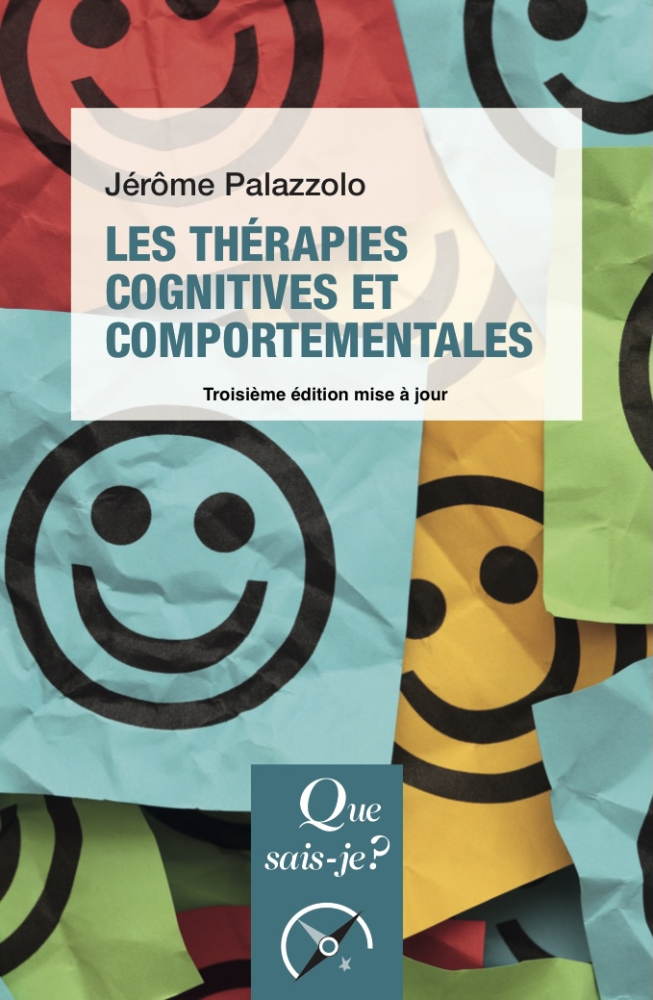

Les thérapies cognitives et comportementales (TCC) soignent, de manière adaptée et durable, les patients qui souffrent de dépression, de troubles anxieux ou encore d’addictions.
Traitant les pensées dysfonctionnelles et les comportements inappropriés, elles favorisent l’apprentissage de conduites plus en adéquation avec l’environnement personnel et professionnel.
Relativement brèves, elles sont scientifiquement évaluées et supposent une étroite collaboration entre le patient et le thérapeute.
Dans la troisième édition mise à jour de cet ouvrage, Jérôme Palazzolo montre concrètement comment les TCC améliorent jour après jour la qualité de vie des personnes en souffrance.
 

