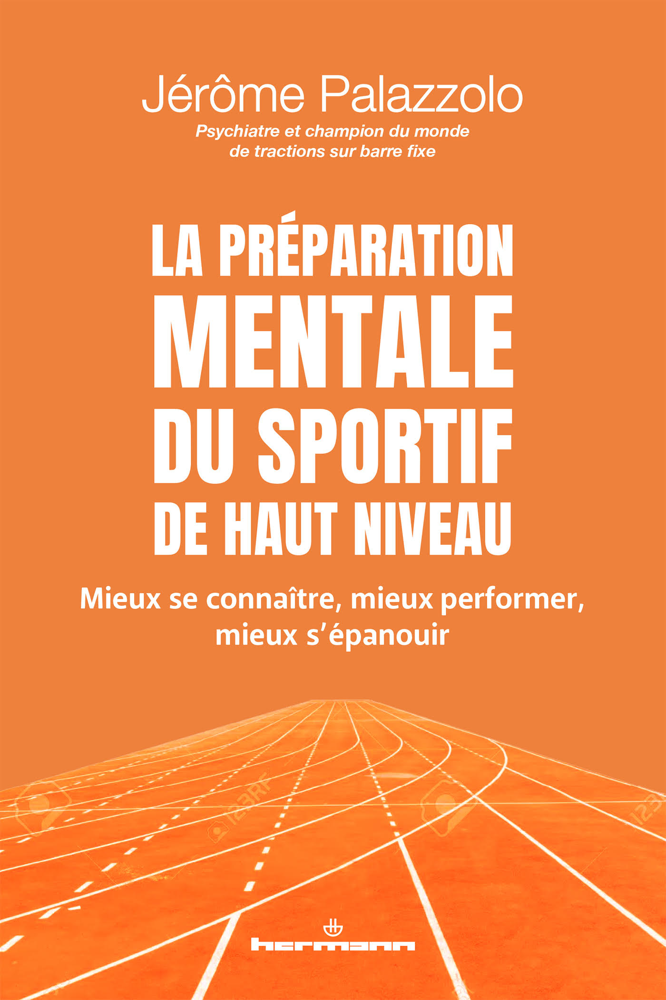

Le sport est généralement perçu comme une activité avant tout physique, mobilisant les ressources du corps pour accomplir des tâches spécifiques et exigeantes.
Des qualités telles que la vitesse, la force, l’endurance, la coordination, l’agilité, la souplesse et la résistance sont grandement sollicitées dans une compétition.
Mais même si l’accent est souvent mis sur le corps, il est aujourd’hui largement reconnu que la performance sportive ne dépend pas uniquement de la condition physique.
Des facteurs psychologiques jouent également un rôle clé.
Certains athlètes semblent avoir un "avantage mental" par rapport à d'autres, pourtant similaires sur le plan physique et en termes d’entraînement.
Ces sportifs gèrent mieux la pression, mettent en œuvre des stratégies de gestion du stress plus efficaces, supportent mieux l’inconfort, se concentrent davantage, trouvent des solutions plus créatives face aux difficultés, se dépassent plus, apprennent plus vite et/ou se préparent mieux aux compétitions.

Tous ces éléments relèvent de la psychologie du sport, qui a aujourd'hui atteint un certain niveau de maturité.
C'est pourquoi aujourd'hui, athlètes, entraîneurs, responsables d'équipe doivent avoir recours à des psychologues du sport pour travailler la motivation, améliorer la concentration, gérer le stress, maîtriser les niveaux d'excitation ou d'anxiété, etc.

L’objectif de cet ouvrage est de proposer aux sportifs, à leurs entraîneurs et au grand public des outils pratiques et concrets leur permettant d’optimiser leur préparation mentale pour mieux performer.

 

