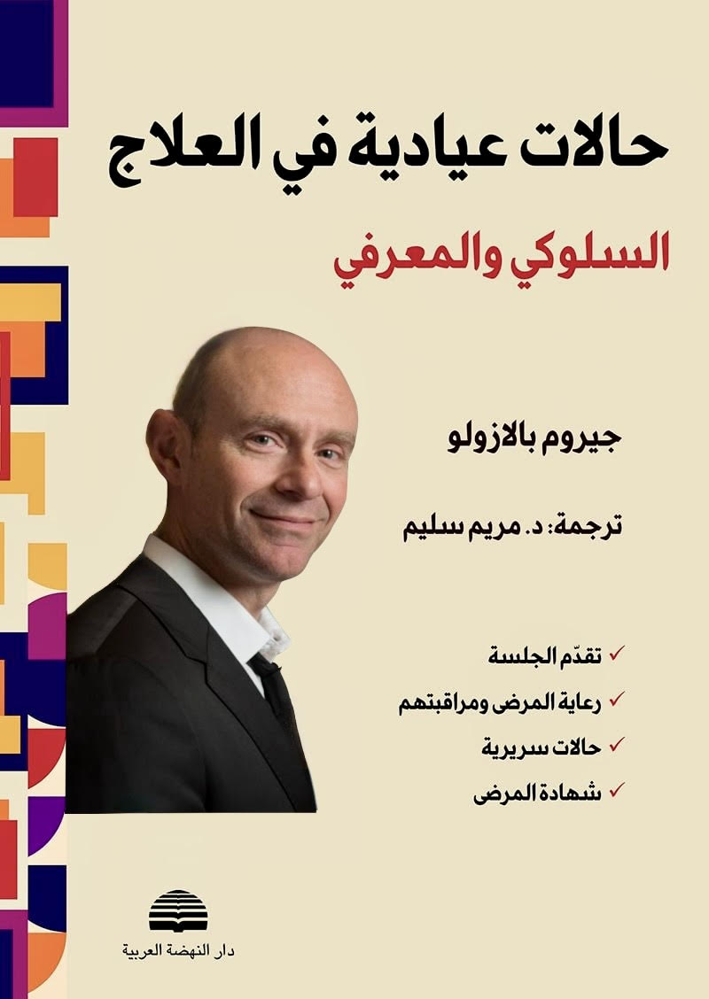

## En arabe

هذه الطبعة الثالثة تم تحديثها، واغناؤها باعترافات المرضى الذين قبلوا البوح باضطراباتهم، ووصف تجربتهم من "الداخل". إلى جانب أن المعالج يكون صاغياً إلى كل ما يبوحون به وما لديهم ليسردونه، كما يجمع في أغلب الأحيان المعلومات التي تتناول محطات التاريخ الشخصي الأساسية. وتكون اعترافات المرضى مضمخة بالانفعالات التي تؤكد كم أن المرض النفسي يشكل منبعاً للألم، وهذا من ضمن ما يذكرنا بالأسباب التي دعتنا إلى اختيار مهنة "معالج".
نأمل أن يكون هذا العمل قادراً على عرض مختلف أساليب الرعاية والعناية المعرفية – السلوكية بطريقة عملية، وأن يصبح الرفيق الثمين للقارىء الذي من اهتماماته وهمومه المعرفة بالأدوات النفسية العلاجية المحسوسة والفعّالة.

## En français

Cette troisième édition a été mise à jour et enrichie par les témoignages de patients qui ont accepté de se confier sur leurs troubles et de décrire leur expérience « de l’intérieur ».
Parallèlement, le thérapeute se met à l’écoute de tout ce qu’ils expriment et de ce qu’ils ont à raconter, tout en recueillant le plus souvent des informations portant sur les étapes essentielles de leur histoire personnelle.
Les confidences des patients sont empreintes d’émotions qui montrent à quel point la maladie psychique est une source de souffrance, ce qui nous rappelle notamment les raisons qui nous ont conduits à choisir le métier de « thérapeute ».

Nous espérons que cet ouvrage saura présenter de manière pratique les différentes approches de prise en charge cognitivo-comportementale et qu’il deviendra un compagnon précieux pour le lecteur intéressé et concerné par la connaissance d’outils psychothérapeutiques concrets et efficaces.

 

